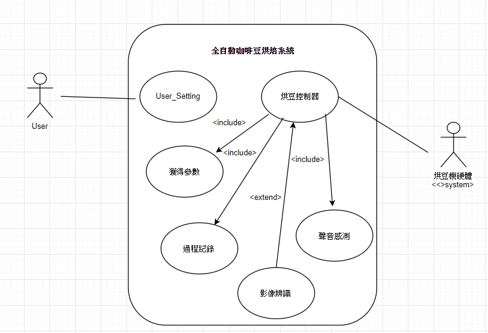
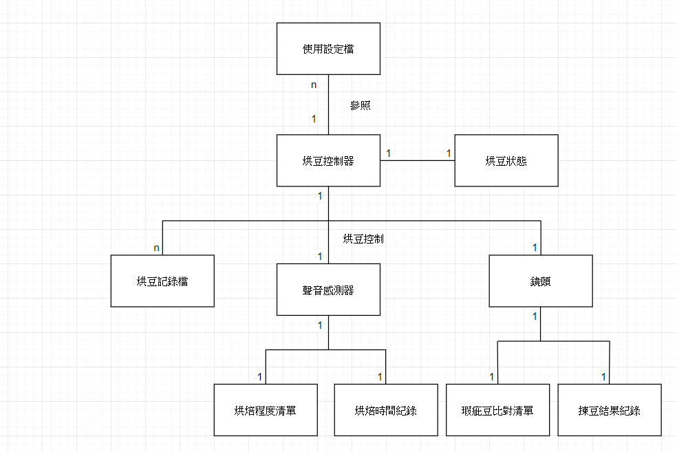

# LING JUN HAO

## 學號: 0624063

### 資管系 三甲

#### 專題名稱:全自動咖啡豆烘焙機


#### 小組成員:`
```
0624063 凌俊豪
0624069 陳晏瑤
0624079 郭維東
0624081 蕭士傑
```
#### 專題需求:
```
適合小型家庭專用，並且結合人工智慧、語音辨識等技術達到自動烘焙、省時省力的目的使用者不管是否熟知烘豆過程透過參數設定
都能夠烘出自己想要的風味
```

#### 功能性(重要程度):
```
1.參數設定 : 設定咖啡產區、咖啡烘焙程度、想要的階段烘焙時間
2.聲音感測(烘焙) : 透過感測咖啡烘豆時的聲音曲線，辨認咖啡目前的烘焙階段，如一爆二爆，設定烘焙程度已到，可以下豆等等
3.烘豆紀錄 : 每一次烘豆時的參數設定、烘焙階段測得的時間點，如有使用到揀豆功能，可以記錄瑕疵豆比例及狀況等等
4.影像辨識(揀豆) : 將咖啡生豆中屬於蟲蛀豆、瑕疵豆等影像透過影像辨識出來
```

#### 非功能性:
```
1.挑豆過程不超過五分鐘
2.瑕疵豆比例10%
3.烘豆深感誤差10%
```

#### 使用案例(描述系統為逹成特定客戶目標所要做的事):
##### 整體烘豆過程
```
1. 使用者設定參數 /  替代案例: 若使用者點選不需揀豆之按鈕
2. 使用者放入咖啡豆
3. 透過影像辨識揀豆   / 替代案例: 則不經過此步驟，直接進入烘烤步驟
4. 機器根據參數開始烘烤
5. 透過聲音感測紀錄時間
6. 達到使用者參數設定即烘烤完成
```
##### 影像辨識
```
1. 使用者放入生豆
2. 開啟揀豆按鍵
3. 透過攝影機拍攝照片
4. 使用經影像訓練的人工智慧機器人辨識是否為瑕疵豆
5. 是瑕疵豆則挑掉
6. 非瑕疵豆則保留
7. 將非瑕疵豆倒入烘豆機內
```
##### 聲音感測
```
1. 使用者輸入想要的參數，烘焙程度，
2. 開始烘焙
3. 聲音感測器判斷是否到達烘焙設定值
4. 是: 停止烘焙，並下豆
5. 否: 繼續烘焙直到達到設定值
6. 下豆後開啟散熱
```

#### 使用案例圖:


#### User_story:
```
使用者:
使用者可以利用參數設定泡出符合自己期望的咖啡
使用者可以利用咖啡過程記錄檔還原自己喜歡的咖啡濃度
使用者可以利用聲音感測去得知烘焙的進度(一爆二爆)
使用者可以利用影像辨識去挑選出優質的咖啡豆
```
```
烘豆機硬體:
烘豆機硬體可以藉由獲得參數去執行程序
烘豆機硬體可以藉由紀錄咖啡過程得到過程紀錄檔案
烘豆機硬體可以藉由聲音感測得到一爆二爆的時間檔案
烘豆機硬體可以藉由影像辨識得到優質豆及劣質豆的詳細資料檔案
```
#### 使用案例類別圖:
#### 1.


